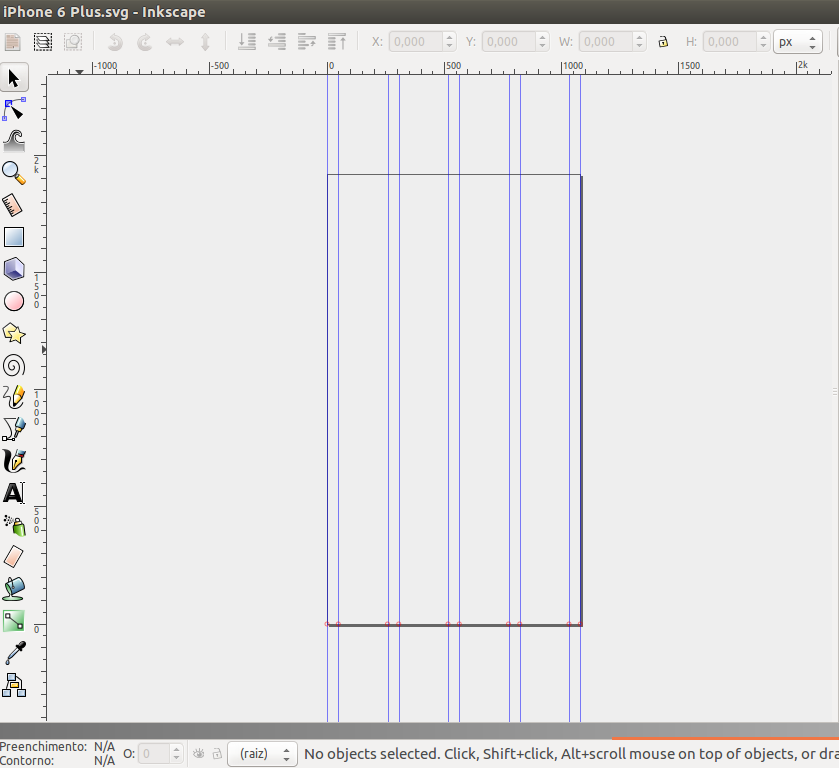

# material-devices-inkscape-grid
I used this code to generate svg-inkcape files with grids guidelines, based on
[Material Design Device Metrics](https://material.io/devices/).
So, you can use this to create you app or webpage wireframes using inkscape and
Material Design rules.

##Iphone 6 Plus exemple:

## how to use?

Just open any file in svg directory using [inkscape](https://inkscape.org/en/)
application and start using.
